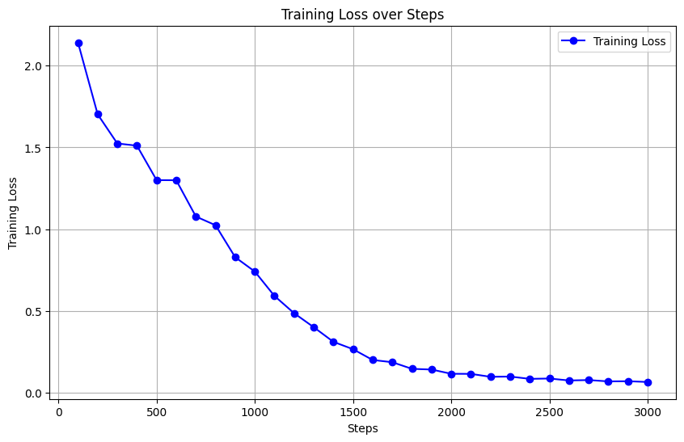
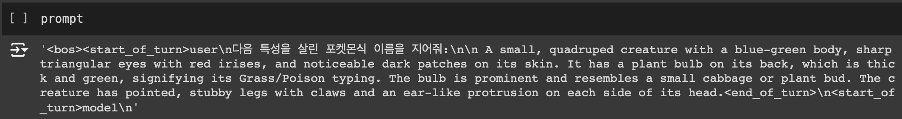
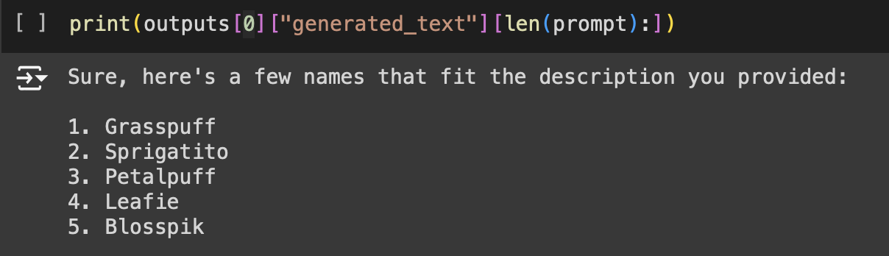

# PokePicker

This repository contains the Poke_picker.ipynb notebook, which is designed to identify Pokémon based on their descriptions. The notebook uses machine learning techniques and Hugging Face models to match Pokémon descriptions to their respective species. This project is ideal for Pokémon enthusiasts and machine learning practitioners who want to explore natural language processing (NLP) techniques applied to the Pokémon universe.

The name of specific pokemon consists of its various characteristics. It can be viewed as extracting 'latent variable' in latent space by original space like an encoder. Since the 'Gemma' is one of the effective LLM using transformer model as a backbone, it would be valid to use Gemma to predict the proper pokemon-like name.  

## Features

- **Pokémon Identification**: The model aims to identify various Pokémon by analyzing textual descriptions.
- **Hugging Face Integration**: Uses datasets or models from Hugging Face to fine-tune the identification process.
- **Data Processing**: The notebook includes code for preprocessing Pokémon descriptions and inputting them into the model.
- **Trian by LoRA**: The whole Gemma model cannot be contained in the free Colab GPU. It is compulsory for users to utilize LoRA, Quantization mechanism.

## Requirements

To run this notebook, you will need the following libraries installed:

- Python 3.x
- Hugging Face Transformers
- PEFT
- bitsandbytes
- Jupyter Notebook
- datasets

You can install the required dependencies by running:

```bash
pip install transformers bitsandbytes transformers peft datasets jupyter
```

## Usage

1. Clone the repository:
    ```bash
    git clone https://github.com/yourusername/poke-picker.git
    cd poke-picker
    ```

2. Open the Jupyter Notebook:
    ```bash
    jupyter notebook Poke_picker.ipynb
    ```

3. Follow the steps in the notebook to preprocess data and train or fine-tune the Pokémon identification model.

## Dataset

The project utilizes Pokémon descriptions, which can be sourced from available datasets on Hugging Face.


### Example of Pokemon Descriptions
    
    1. Pikachu: A yellow Pokémon that has long ears and a tail in the shape of a lightning bolt. It generates electricity to attack enemies.
    2. Bulbasaur: A small, quadrupedal Pokémon with a large bulb on its back, which grows into a large plant as it evolves.

### Substitute the description data for Chatting form

In according to official Google Gemma Huggingface, the chat template is required:

>The instruction-tuned models use a chat template that must be adhered to for conversational use.
>The easiest way to apply it is using the tokenizer's built-in chat template, as shown in the following snippet.

So, the above description of pokemon data is translated to chat template like below:

><bos><start_of_turn>user
>다음 특성을 살린 포켓몬식 이름을 지어줘:
>A small, quadruped creature with a blue-green body, sharp triangular eyes with red irises, and noticeable dark patches on its skin. It has a plant bulb on its back, which is thick and green, signifying its Grass/Poison typing. The bulb is prominent and resembles a small cabbage or plant bud. The creature has pointed, stubby legs with claws and an ear-like protrusion on each side of its head.<end_of_turn>
><start_of_turn>model


## Fine-Tuning

You can fine-tune the model using a dataset of Pokémon descriptions. The notebook outlines the following steps for fine-tuning:

1.	Load the Pre-trained Model: The pre-trained language model is fetched from Hugging Face using transformers.
2.	Prepare the Dataset: Tokenize and format the Pokémon descriptions using the appropriate tokenizer.
3.	Train the Model: Use transfer learning to fine-tune the model on your specific dataset.
4.	Evaluate the Results: After fine-tuning, test the model on a validation set and analyze the accuracy.

### Training Information

1. num_train_epochs = 8
2. max_steps=3000
3. per_device_train_batch_size=1
4. fp16=True
5. Using LoRA


## Results

The notebook includes code to evaluate the performance of the Pokémon identifier. After running the notebook, you will be able to see the accuracy of the model and how well it can classify Pokémon based on their descriptions.

### Training loss


### Inference with new fine-tuned model
- **Query**
  
- **Response**
  

## Further Improvements

- **Increase the Dataset Size**: Incorporate a larger dataset of Pokémon descriptions, including variations in different languages.
- **Add More Features**: Incorporate more complex NLP techniques, such as BERT-based models, to improve the accuracy of Pokémon identification.

## License

This project is licensed under the MIT License.
